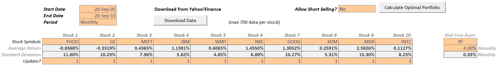
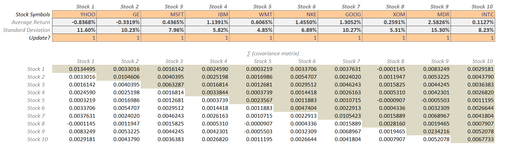
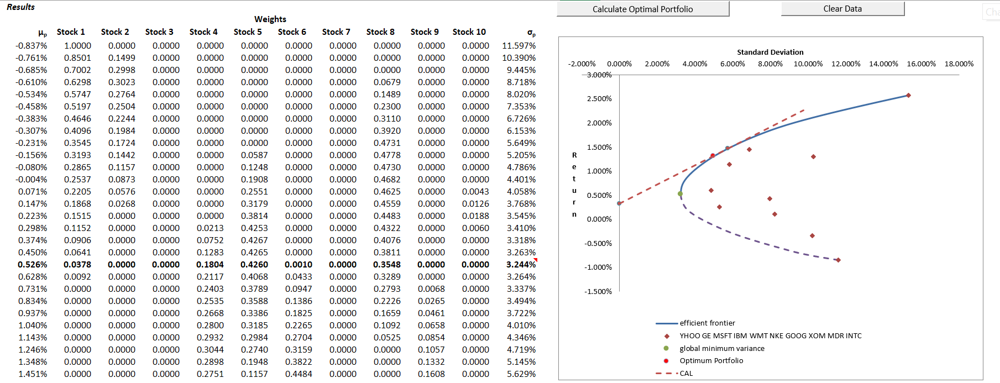
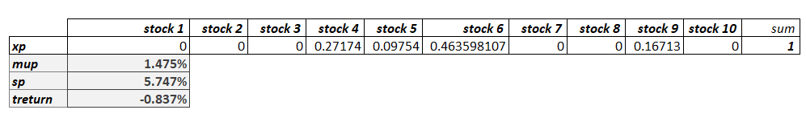
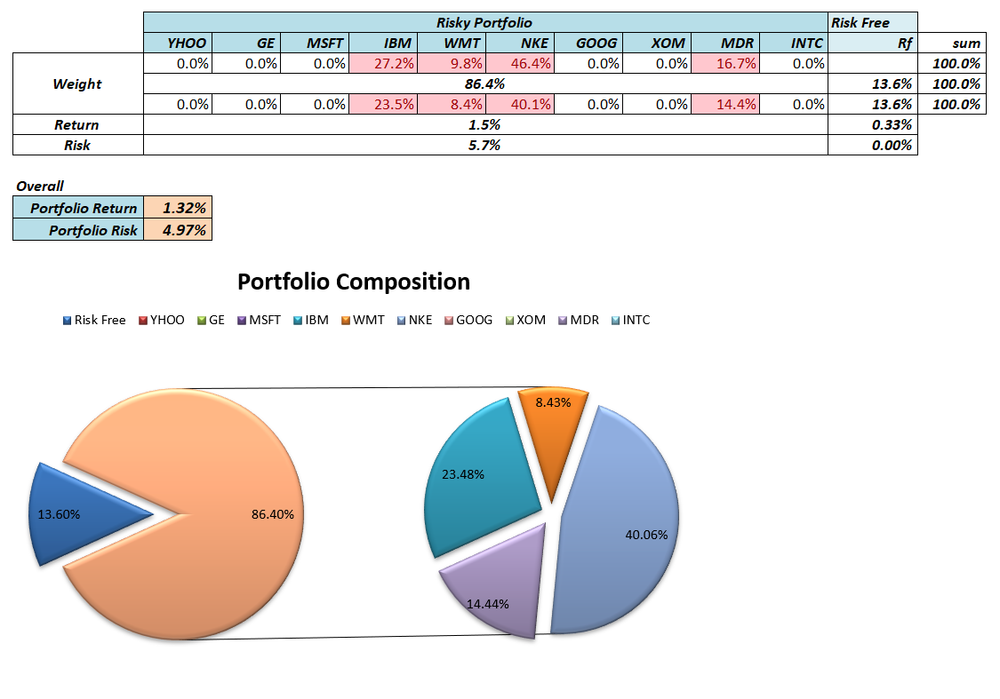

# excel-capm
This Excel model was created to help students understanding the concept of *Efficient Frontier* as part of Capital Market class.
  
### Data Preparation
Inputs:
- `Start Date`, `End Date`
- `Period` *(Daily, Weekly, Monthly)*
- `Allow Short Selling`
- `Stock Symbols`
- `Risk free rate return`
- `Degree of Risk Aversion`

Click the `Download` button to get the stock data from Yahoo finance.  
  
### Covariance calculation

After the data is downloaded, the **Covariance Matrix** of those stocks is automatically calculated using the excel formula. 

This **Covariance Matrix** calculation is a required input for the VBA to calculate the **Efficient Frontier** of theses stocks.
  

### Portfolio Optimization

  
### Result
